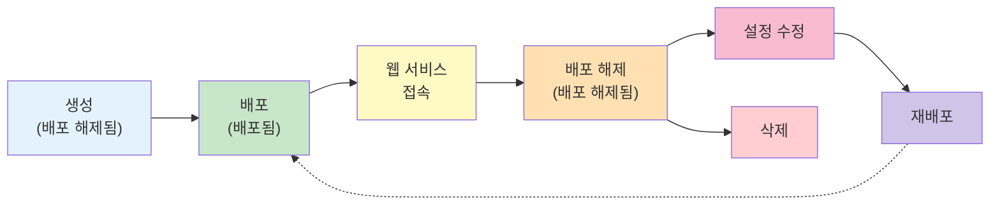

# 애플리케이션 관리

생성된 애플리케이션을 배포하고 실행하며, 필요에 따라 설정을 변경하거나 삭제하는 방법을 안내합니다.

애플리케이션은 생성 후 **배포 해제됨** 상태로 시작하며, 배포를 통해 실행할 수 있습니다.
배포된 애플리케이션은 웹 서비스를 제공하고, 중지 시 리소스를 반환하지만 데이터는 유지됩니다.

> 프로젝트 > **애플리케이션** 메뉴

---

## 애플리케이션 생애주기

애플리케이션은 다음과 같은 생애주기를 가집니다:

1. **생성**: [앱 카탈로그](../app-create/catalog-app.md) 또는 [Helm 직접 배포](../app-create/custom-app.md)로 애플리케이션 생성
2. **배포 (실행)**: 배포 해제된 애플리케이션을 실행하여 컴퓨팅 리소스 할당
3. **접속**: 배포된 웹 서비스에 브라우저로 접속
4. **배포 해제 (중지)**: 리소스 반환 (데이터는 유지)
5. **수정**: 배포 해제된 상태에서 설정 변경
6. **삭제**: 애플리케이션 및 데이터 완전 제거

---

## 주요 내용

-    **애플리케이션 실행 제어**

    ---

    애플리케이션 배포, 중지, 배포 상태 확인, 웹 서비스 접속 방법을 안내합니다.

     [실행 제어하기](runtime-control.md)

-    **애플리케이션 수정 · 삭제**

    ---

    설정 변경, 리소스 조정, 사용하지 않는 애플리케이션 삭제 방법을 안내합니다.

     [수정 · 삭제하기](update-delete.md)

---

## 애플리케이션 상태

애플리케이션 목록에서 각 애플리케이션의 현재 상태를 확인할 수 있습니다.

| 상태 | 의미 | 가능한 작업 |
|------|------|------------|
| **배포됨** | 정상적으로 실행 중 | 웹 서비스 접속, 중지, 삭제 |
| **배포 해제됨** | 중지된 상태 | 배포, 설정 수정, 삭제 |

> **Tip**: 상태별 작업 가이드
>
> - **배포됨** 상태의 애플리케이션을 수정하려면 먼저 [배포 해제](runtime-control.md#stop-app)해야 합니다.
> - **배포 해제됨** 상태에서는 [설정 수정](update-delete.md#edit-app) 후 다시 배포할 수 있습니다.

---