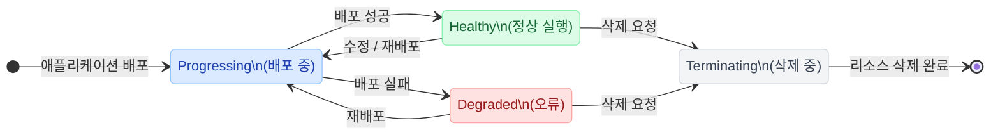

# 애플리케이션 실행 제어

생성된 애플리케이션을 배포(실행)하거나 중지하고, 배포 상태를 확인하며, 배포된 웹 서비스에 접속하는 방법을 안내합니다.

> 프로젝트 > **애플리케이션** 메뉴

## 애플리케이션 상태

애플리케이션은 아래 7가지 상태 중 하나를 가지며, 배포·수정·삭제 요청에 따라 상태가 전환됩니다.

| Status          | 상태       | 설명                                | 가능한 작업         |
| --------------- | -------- | --------------------------------- | -------------- |
| **Progressing** | 배포 중     | 애플리케이션 생성 또는 업데이트 진행 상태           | 대기             |
| **Healthy**     | 정상 실행    | 애플리케이션 리소스 정상 실행 상태               | 접속, 중지, 수정, 삭제 |
| **Degraded**    | 오류       | 애플리케이션 리소스 비정상 또는 오류 상태           | 수정, 재배포, 삭제    |
| **Suspended**   | 중지됨      | 애플리케이션 실행 일시 중지 상태                | 배포, 수정, 삭제     |
| **Missing**     | 리소스 누락   | 애플리케이션이 참조하는 Kubernetes 리소스 누락 상태 | 재배포, 삭제        |
| **Unknown**     | 상태 확인 불가 | 애플리케이션 상태 확인 불가 상태                | 새로고침           |
| **Terminating** | 삭제 중     | 애플리케이션 리소스 삭제 진행 상태               | 대기             |

---

## 애플리케이션 배포 (실행)

애플리케이션을 실행하여 서비스를 시작합니다.

1. 프로젝트 화면에서 **애플리케이션** 메뉴로 이동합니다.

    

2. 애플리케이션 목록에서 실행할 애플리케이션 카드를 클릭합니다.

    - 상태가 **배포 해제됨**인 경우에만 실행할 수 있습니다.

3. 애플리케이션 상세 화면 우측 상단의 **배포** 버튼을 클릭합니다.

    

4. 배포가 시작되면 상태가 **배포 해제됨** → **배포됨**으로 변경됩니다.

---

### 배포 상태 확인

배포 진행 상태와 리소스 상태를 확인할 수 있습니다.

**애플리케이션 상세 화면에서 확인 가능한 정보:**

- **상태**: 배포됨, 배포 해제됨
- **Argo CD 링크**: 상세한 배포 상태 확인
- **생성 시간**: 애플리케이션 생성 일시

> **Info**: Argo CD로 상세 상태 확인
>
> 애플리케이션 상세 화면의 **Argo CD** 링크를 클릭하면, GitOps 배포 도구인 Argo CD 화면으로 이동하여 더 상세한 배포 상태를 확인할 수 있습니다.
>
>   
>
> - 각 리소스의 동기화 상태
> - Pod, Service, Deployment 등 Kubernetes 리소스 상태
> - 배포 이력 및 롤백 기능

> **Note**: 정상 동작하지 않을 경우 대처 방법
>
> 정상적으로 실행되지 않을 경우:
>
> 1. **Argo CD 링크**를 클릭하여 상세한 오류 원인을 확인합니다.
> 2. 주요 오류 원인:
>     - 리소스 부족 (CPU, 메모리, GPU 할당 초과)
>     - 잘못된 values.yaml 설정
>     - 이미지 pull 실패
>     - 스토리지 마운트 실패
> 3. **편집** 버튼으로 설정을 수정한 후 다시 배포합니다.

---

## 애플리케이션 웹 서비스 열기

배포된 애플리케이션이 웹 서비스를 제공하는 경우, 브라우저에서 직접 접속할 수 있습니다.

> **Warning**: 접속 전 필수 조건
>
> 외부에서 애플리케이션에 접속하려면 **애플리케이션 생성 시** 다음 설정이 완료되어 있어야 합니다:
>
> - **httpRoute 활성화**: values.yaml에서 `httpRoute.enabled: true` 설정
> - **애플리케이션 열기 링크 추가**: 외부 접속 URL 지정
>
> 자세한 설정 방법은  **[httpRoute 설정 가이드](../app-create/catalog-app.md#httproute)**를 참고하세요.

1. 프로젝트 화면에서 **애플리케이션** 메뉴로 이동합니다.

    

2. 애플리케이션 목록에서 접속할 애플리케이션 카드를 클릭합니다.

3. 애플리케이션 상세 화면 우측 상단의 **열기** > (생성한 버튼 이름) 버튼을 클릭합니다.

    

    - 새 브라우저 탭에서 해당 애플리케이션의 웹 서비스 화면이 열립니다.
      

> **Info**: 엔드포인트 주소 복사
>
> **열기** 버튼 대신, 애플리케이션 상세 화면의 **헬름 차트**의 httpRoute: 영역에 표시된 엔드포인트 주소를 직접 복사하여 사용할 수도 있습니다.
> 

---

## 애플리케이션 배포 해제

배포된 애플리케이션을 중지하여 리소스를 반환합니다.

1. 프로젝트 화면에서 **애플리케이션** 메뉴로 이동합니다.
    
    

2. 애플리케이션 목록에서 중지할 애플리케이션 카드를 클릭합니다.

3. 애플리케이션 상세 화면 우측 상단의 **배포 해제** 버튼을 클릭합니다.

    

    - 애플리케이션이 중지되면 상태가 **배포 해제됨**으로 변경됩니다.

> **Warning**: 중지 시 주의사항
>
> - 애플리케이션을 중지하면 할당된 CPU, 메모리, GPU 등의 컴퓨팅 리소스가 즉시 반환됩니다.
> - **볼륨에 저장된 데이터는 유지**되므로, 다시 배포하면 이전 작업을 이어서 진행할 수 있습니다.  
> 단, Empty Dir 타입의 임시 스토리지에 저장된 데이터는 애플리케이션 중지 시 삭제됩니다.

---