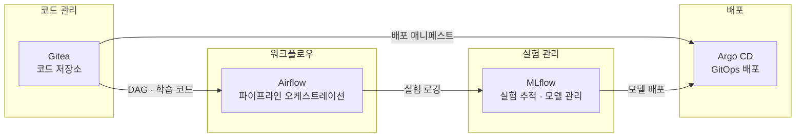
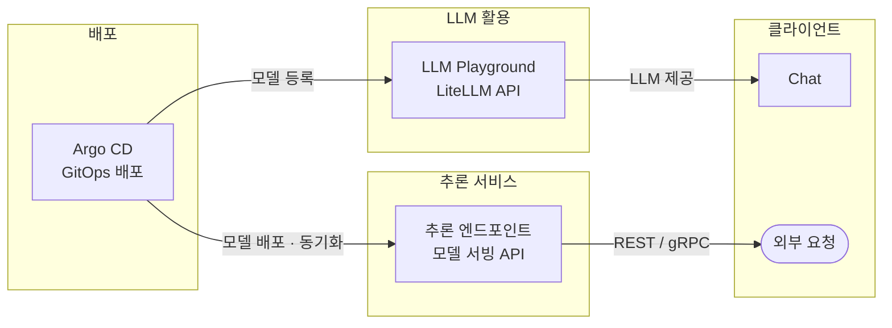
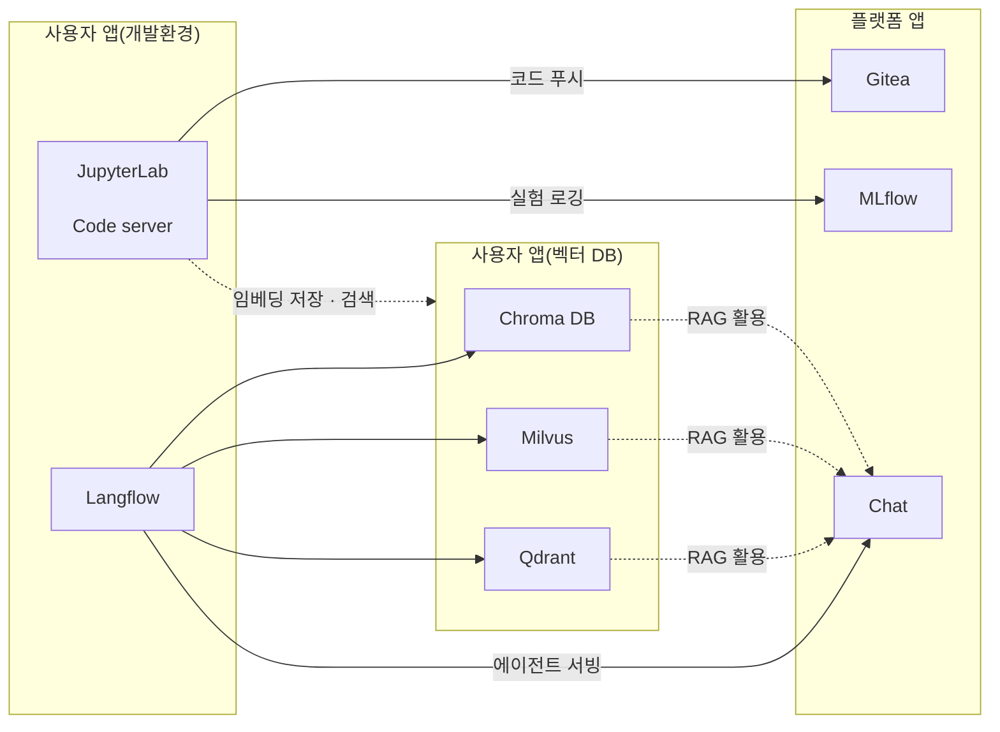

# 애플리케이션 간 연계 흐름

Runway에서 제공하는 애플리케이션 생태계는 플랫폼 앱과 사용자 앱(카탈로그 기반 배포)으로 구성되며,
각 앱은 코드 관리, 실험, 배포, 추론, 협업 흐름 안에서 역할을 나눠 유기적으로 연결될 수 있습니다.
이 문서에서는 대표적인 연계 흐름을 예시로 소개하며, 실제 프로젝트에서는 요구사항에 따라 다르게 구성할 수 있습니다.

> **Info**: 선택 가능한 활용 패턴
> 이 문서에서 소개하는 연계 흐름은 Runway 플랫폼의 대표적인 활용 패턴입니다.
> 프로젝트 특성과 팀의 워크플로우에 따라 일부 연결만 사용하거나 다른 방식으로 구성할 수 있습니다.

---

## 플랫폼 앱 간 연계 흐름

플랫폼 앱은 프로젝트 공통 인프라로 활용할 수 있으며, 코드 관리부터 배포와 서비스 노출까지의 흐름을 구성할 수 있습니다.
아래는 플랫폼 앱을 활용한 대표적인 운영 흐름 예시입니다.

### 코드 관리 → 실험 → 배포

**대표적인 파이프라인 연계**

| 연결 | 설명 |
|------|------|
| Gitea → Airflow | DAG 파일과 학습 스크립트를 Gitea에서 관리하고, Airflow가 이를 실행 |
| Airflow → MLflow | Airflow 파이프라인 실행 시 MLflow에 실험 메트릭·아티팩트 자동 기록 |
| MLflow → Argo CD | 검증 완료된 모델을 Argo CD를 통해 서빙 환경에 배포 |

**GitOps 배포 연계**

| 연결 | 설명 |
|------|------|
| Gitea → Argo CD | 배포 매니페스트(YAML)를 Gitea에 저장하고, Argo CD가 동기화하여 배포 |

---

### 배포 → 추론 서비스 / LLM 활용

**모델 서빙 연계**

| 연결 | 설명 |
|------|------|
| Argo CD → 추론 엔드포인트 | 모델 서빙 API를 배포하고 상태를 동기화 |
| 추론 엔드포인트 → 외부요청 | REST / gRPC를 통해 외부 클라이언트에 추론 결과 제공 |

**LLM 활용 연계**

| 연결 | 설명 |
|------|------|
| Argo CD → LLM Playground | 배포된 모델을 LLM API 게이트웨이에 등록 |
| LLM Playground → Chat | LLM Playground에 등록된 모델을 Chat에서 대화형으로 활용 |

---

## 플랫폼 앱과 카탈로그 앱 연계 흐름

프로젝트 앱(카탈로그 배포 앱)은 개발·실험 작업을 수행하는 실행 환경으로, 필요에 따라 플랫폼 앱과 연계하여 결과를 저장·배포·활용할 수 있습니다.
아래는 프로젝트 단위 앱이 플랫폼 앱과 연계되는 대표적인 사용 흐름입니다.

### 프로젝트 내 개발·활용 (앱 카탈로그 연계)

프로젝트의 [앱 카탈로그](../app-create/catalog-app.md)에서 배포한 개발 도구와 데이터 인프라가 플랫폼 앱과 연결됩니다.

**개발 환경 연계**

| 연결 | 설명 |
|------|------|
| JupyterLab · Code server → Gitea | 개발 환경에서 작성한 코드를 Gitea 저장소에 푸시 |
| JupyterLab · Code server → MLflow | 개발 환경에서 실행한 실험 결과를 MLflow에 자동 로깅 |

**벡터 데이터 연계**

| 연결 | 설명 |
|------|------|
| JupyterLab · Code server → 벡터 DB | 개발 환경에서 생성한 임베딩을 벡터 DB에 저장하고 검색 |

**RAG 파이프라인 연계**

| 연결 | 설명 |
|------|------|
| Langflow → 벡터 DB | Langflow에서 RAG 파이프라인 구성 시 Chroma DB · Milvus · Qdrant를 검색 소스로 활용 |
| 벡터 DB → Chat | 벡터 DB에 저장된 임베딩을 Chat의 RAG 검색에 활용 |

**에이전트 서빙 연계**

| 연결 | 설명 |
|------|------|
| Langflow → Chat | Langflow에서 구축한 에이전트를 Chat에서 대화형으로 서빙 |