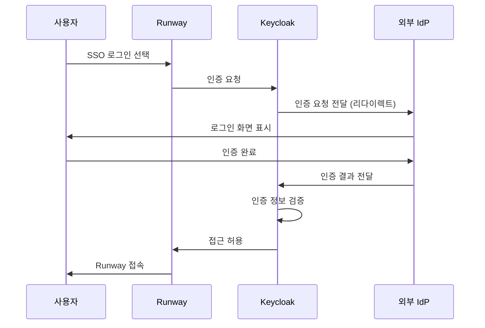

# 로그인 및 인증

Runway는 **Keycloak 기반의 통합 인증 시스템**을 사용하며, 설치 환경에 적용된 계정 관리 정책에 따라 로그인 방식이 달라질 수 있습니다.

아래 URL 형식으로 Runway에 접속합니다.

```
https://runway.{베이스 도메인}/
```

> **Info**: 베이스 도메인
> Runway는 설치 환경마다 고유한 도메인(베이스 도메인)을 사용합니다. 정확한 접속 주소는 관리자에게 문의하세요.

---

## 로그인 방식

Runway는 **Keycloak 기반의 통합 인증 시스템**을 사용하며, 설치 환경에 따라 다음 두 가지 로그인 방식을 사용할 수 있습니다.

- **이메일/비밀번호 로그인** (기본 제공)
- **SSO(Single Sign-On) 로그인** (설치 환경에 따라 제공)

---

### 이메일/비밀번호 로그인

설치 환경에서 SSO를 사용하지 않는 경우, 이메일과 비밀번호를 사용한 로그인만 가능합니다.

1. 웹 브라우저에서 Runway 접속 URL을 입력합니다.

2. 로그인 화면에서 **이메일**과 **비밀번호**를 입력합니다.
    

3. **로그인** 버튼을 클릭하여 플랫폼에 접속합니다.

> **Info**: 사용자 계정 생성 방식
> 이메일/비밀번호 로그인을 사용하는 경우, Runway 계정은 **워크스페이스 관리자의 초대**를 통해 생성됩니다.
>
> 사용자는 직접 계정을 생성할 수 없으며, 다음 절차를 통해 계정을 활성화합니다.
>
> 1. 워크스페이스 관리자가 사용자 **이메일로 초대장을 발송**합니다.
> 2. 사용자는 **초대 이메일의 링크를 클릭**합니다.
> 3. **초기 비밀번호를 설정**하여 계정을 활성화합니다.
>
> 계정 신규 등록 및 워크스페이스 직접 추가는 **플랫폼 관리자**만 할 수 있습니다.  
> 워크스페이스 관리자는 **플랫폼에 이미 등록된 계정**에 한해 워크스페이스로 초대할 수 있습니다.

---

### SSO(Single Sign-On) 로그인

설치 환경에서 SSO가 활성화된 경우, 로그인 화면에서 **외부 인증 제공자(IdP)**를 통해 로그인할 수 있습니다.  
SSO 로그인을 지원하는 환경에서는 Runway 계정/비밀번호 또는 SSO를 통해 로그인하는 두 방식을 모두 사용할 수 있습니다.

> **Note**: 계정 선택
> 브라우저에 여러 개의 Google 계정이 로그인되어 있는 경우,  
> SSO 로그인 과정에서 **설치 환경의 IdP에 등록된 Google 계정**을 선택해야 합니다.

---

## 인증 구조 개요(Keycloak 기반)

Runway는 **Keycloak** 기반의 인증 및 접근 관리(IAM, Identity and Access Management) 체계를 사용합니다.  
Keycloak은 사용자 인증과 세션 관리를 중앙에서 처리하며, Runway 내 모든 서비스에 대해 **일관된 인증 흐름**을 제공합니다.

Runway에서 제공하는 이메일/비밀번호 로그인과 SSO(Single Sign-On) 로그인은  
모두 Keycloak을 통해 처리되며, 사용자 입장에서는 로그인 방식이 달라도 **동일한 인증 체계**를 사용하게 됩니다.

### Keycloak의 역할

Keycloak은 Runway에서 다음과 같은 역할을 담당합니다.

- **인증 처리의 중앙화**  
  사용자의 로그인 요청을 단일 인증 시스템에서 처리하여, 서비스별로 인증 방식을 분산 관리하지 않습니다.

- **다양한 인증 방식 지원**  
  이메일/비밀번호 로그인과 외부 IdP(SSO)를 동일한 인증 흐름으로 통합합니다.

- **세션 및 토큰 관리**  
  로그인 이후 사용자 세션을 관리하고, 일정 시간 비활성 시 자동 로그아웃을 수행합니다.

- **보안 정책 적용**
  비밀번호 정책, 로그인 시도 제한 등 설치 환경의 계정 관리 정책을 중앙에서 일괄 적용합니다.

> **Info**: 외부 연동 앱 Keycloak 인증
>
> Runway가 기본 제공하는 플랫폼 앱(Gitea, MLflow, Airflow 등)의 URL로 직접 접속하는 경우에도 Keycloak 기반의 동일한 인증이 적용됩니다.
> Runway에 로그인된 상태라면 keyloak 로그인 버튼을 통해 각 애플리케이션을 바로 사용할 수 있습니다.

---

### SSO 연동 구조

설치 환경에서 SSO를 사용하는 경우, Keycloak은 Google과 같은 **외부 인증 제공자(IdP)와 연동되어 사용자 인증을 처리**합니다.

이 경우 인증 흐름은 다음과 같습니다.



SSO를 사용하는 경우,
Runway는 사용자의 비밀번호를 직접 관리하지 않으며, 설치 환경에 구성된 IdP의 인증 체계를 그대로 활용합니다.