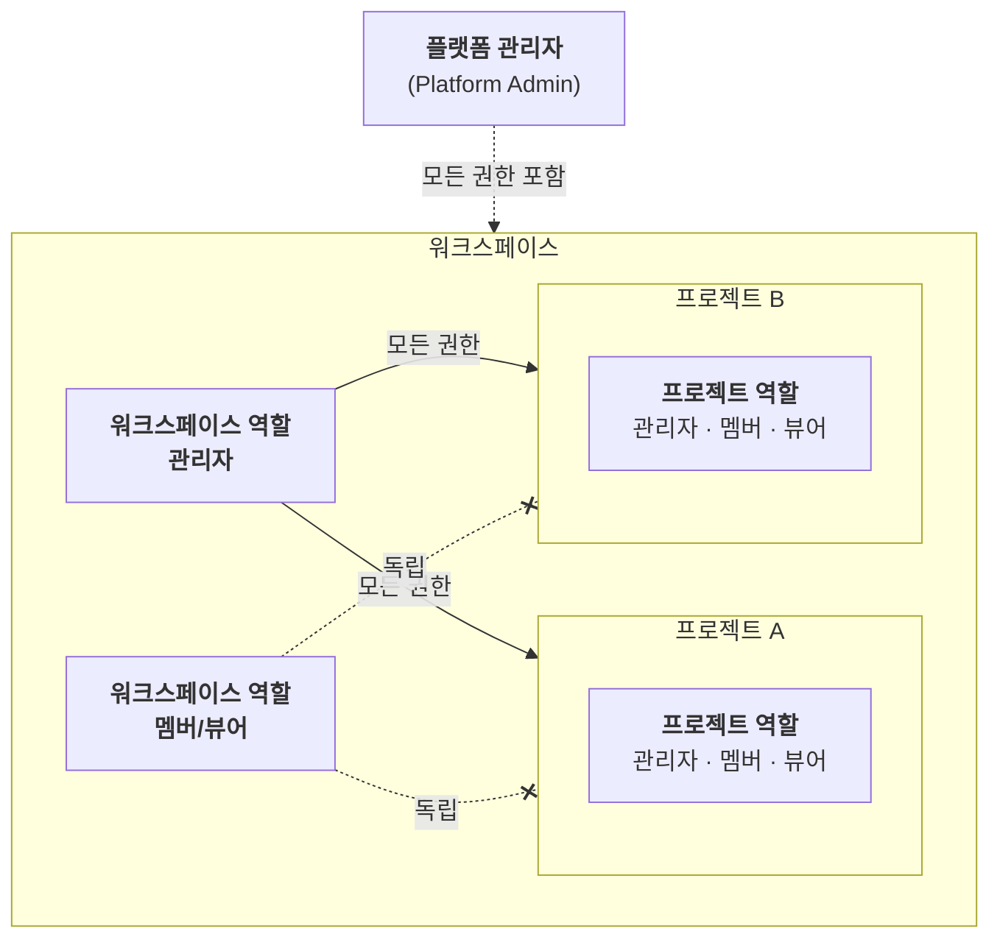

# 사용자 역할 및 접근 범위

Runway는 **워크스페이스**와 **프로젝트** 단위로 사용자를 관리하며, 각 단위에서 독립적으로 역할(Role)을 부여받습니다. 워크스페이스에 처음 접속하기 전에 아래 역할 구조를 이해하면 본인이 할 수 있는 작업 범위를 파악하는 데 도움이 됩니다.

## 계층별 역할 구조 및 핵심 원칙

> **Info**: 역할 구조 핵심 원칙
>
> (관리자를 제외한) **워크스페이스 역할과 프로젝트 역할은 독립적입니다.**
>
> - 워크스페이스 역할은 워크스페이스 수준의 권한(프로젝트 생성, 사용자 초대 등)만 결정합니다.
> - 프로젝트 내 **실무 권한(애플리케이션 관리, 리소스 관리 등)은 프로젝트 역할에 의해 별도로 결정**됩니다.  
> 예를 들어, 워크스페이스에서 **뷰어**라도 프로젝트에서는 **멤버** 또는 **관리자** 역할로 참여할 수 있습니다.

> **Note**: 워크스페이스 관리자
>
> **워크스페이스 관리자**는 예외적으로 워크스페이스 내 모든 프로젝트에서 가입 여부나 프로젝트 내 역할과 관계없이 **전체 권한을 보유**합니다.

> **Note**: 플랫폼 관리자
>
> Runway에는 위 역할과 별도로 **플랫폼 관리자**(Platform Admin)가 존재합니다. 플랫폼 관리자는 별도의 **Runway 관리센터**에서 워크스페이스 생성·삭제, 사용자 계정 관리, 클러스터 리소스 모니터링, 보안 설정 등 플랫폼 전체를 관리하는 슈퍼 관리자입니다.
>
> 플랫폼 관리자는 하위 모든 워크스페이스·프로젝트의 권한을 포함합니다. 플랫폼 관리 기능에 대한 자세한 내용은 플랫폼 관리자에게 별도 제공되는 **Runway 운영자 가이드**를 참고하세요.

---

## 범위별 역할 및 권한

Runway에서 역할은 **시스템에서 제공하는 기본 역할(System)**과 프로젝트 **관리자가 정의한 사용자 정의 역할(Custom)**로 나뉩니다.
워크스페이스와 프로젝트 각각에서 **기본 역할(관리자/멤버/뷰어)을 제공**하며, 역할에 따라 접근 가능한 기능이 달라집니다. 관리자가 생성한 **사용자 정의 역할**이 부여될 수도 있습니다.

> **Info**: 사용자 정의 역할
> 워크스페이스와 프로젝트 모두 기본 역할(관리자/멤버/뷰어) 외에 **사용자 정의 역할**을 생성하여 세분화된 권한을 부여할 수 있습니다. 자세한 내용은  **[워크스페이스 역할 관리](../../manage/workspace/workspace-roles.md)** 및  **[프로젝트 역할 관리](../../manage/project/project-roles.md)**를 참고하세요.

---

### 워크스페이스 역할 및 주요 권한

워크스페이스에 초대되면 아래 기본 역할 중 하나를 부여받습니다. 이 역할은 **워크스페이스 수준의 권한**을 결정하며, 프로젝트 내 실무 권한과는 별개입니다.

**워크스페이스 기본 제공 역할의 종류**

| 역할 | 핵심 권한 | 비고 |
|---|---|---|
| **관리자**(Admin) | 워크스페이스 설정, 사용자·역할 관리, 프로젝트 생성 | 해당 워크스페이스에 한정 |
| **멤버**(Member) | 프로젝트 생성, 사용자 초대 등 워크스페이스 내 제한적 운영 | 사용자 관리 불가 |
| **뷰어**(Viewer) | 워크스페이스 정보 조회만 가능 | 변경 권한 없음 |

**워크스페이스 역할별 주요 권한**

| 기능 | 관리자 | 멤버 | 뷰어 |
|------|:------:|:----:|:----:|
| 사용자 초대 | O | O | |
| 사용자 관리 | O | | |
| 프로젝트 생성 | O | O | |
| 리소스 할당 관리 | O | | |
| 워크스페이스 정보/역할 조회 | O | O | O |
| 워크스페이스 정보/역할 관리 | O | | |

---

### 프로젝트 역할 및 주요 권한

프로젝트에 참여하면 아래 기본 역할 중 하나를 부여받습니다. 프로젝트 역할은 **프로젝트 내 리소스 관리, 애플리케이션 실행 등 실무 권한**을 결정합니다.

**프로젝트 기본 제공 역할의 종류**

| 역할 | 핵심 권한 | 비고 |
|---|---|---|
| **관리자**(Admin) | 프로젝트 설정, 사용자·역할 관리, 리소스·애플리케이션 관리 | 해당 프로젝트에 한정 |
| **멤버**(Member) | 애플리케이션 생성·배포 등 주요 실무 기능 사용 | 사용자·역할 관리 불가 |
| **뷰어**(Viewer) | 모델, 서비스, 리소스 현황 등 조회만 가능 | 변경 권한 없음 |

**프로젝트 역할별 주요 권한**

| 기능 | 관리자 | 멤버 | 뷰어 |
|------|:------:|:----:|:----:|
| 사용자 추가 | O | O | |
| 사용자 관리 | O | | |
| 애플리케이션 생성/수정 | O | O | |
| 애플리케이션 삭제 | O | | |
| 모델 배포/관리 | O | O | |
| 리소스 조회 | O | O | O |
| 리소스 관리 | O | | |
| 프로젝트 정보/역할 조회 | O | O | O |
| 프로젝트 정보/역할 관리 | O | | |

---

### 프로젝트 내 플랫폼 앱 사용 권한

Runway 플랫폼 앱(Gitea, ArgoCD, Airflow, MLflow, SeaweedFS, OpenBao, Langfuse)에 대한 접근 권한은 프로젝트 역할을 기준으로 관리됩니다.

**시스템 역할 — 플랫폼 앱 자동 매핑**

프로젝트의 기본 역할(시스템 역할)인 사용자의 경우, 배정된 역할이 각 플랫폼 앱에도 자동으로 매핑됩니다.

| 프로젝트 역할 | 플랫폼 앱 역할 |
|---|---|
| **관리자**(Admin) | 각 앱의 Admin |
| **멤버**(Member) | 각 앱의 Member |
| **뷰어**(Viewer) | 각 앱의 Viewer |

**사용자 정의 역할 — 앱별 개별 설정**

사용자 정의 역할은 플랫폼 앱(Gitea, OpenBao, Airflow, SeaweedFS, MLflow, Langfuse)별로 역할을 개별 지정할 수 있습니다. 설정하지 않으면 해당 앱에 접근할 수 없습니다.

 **[프로젝트 역할 관리](../../manage/project/project-roles.md#create-project-role)**

---

## 전체 역할 및 권한 참조표

아래 표는 플랫폼·워크스페이스·프로젝트 전체 역할을 한눈에 비교한 참조표입니다.

  
    
      구분
      역할
      프로젝트 관리
      사용자 관리
      리소스 관리
      애플리케이션 관리
    
  
  
    
      <strong>플랫폼</strong>
      <strong>관리자</strong>(Admin)
      (모든 워크스페이스의 전체 권한 보유)
    
    
      <strong>워크스페이스</strong>
      <strong>관리자</strong>(Admin)
      (해당 워크스페이스 내 전체 권한 보유)
    
    
      <strong>멤버</strong>(Member)
      생성
      워크스페이스사용자 초대
      (프로젝트 역할에 따름)
    
    
      <strong>뷰어</strong>(Viewer)
      조회
      조회
    
    
      <strong>프로젝트</strong>
      <strong>관리자</strong>(Admin)
      수정/삭제
      추가/수정/제거
      수정
      생성/수정/삭제
    
    
      <strong>멤버</strong>(Member)
      조회
      프로젝트사용자 추가
      조회
      생성/수정/삭제
    
    
      <strong>뷰어</strong>(Viewer)
      조회
      조회
      조회
      조회