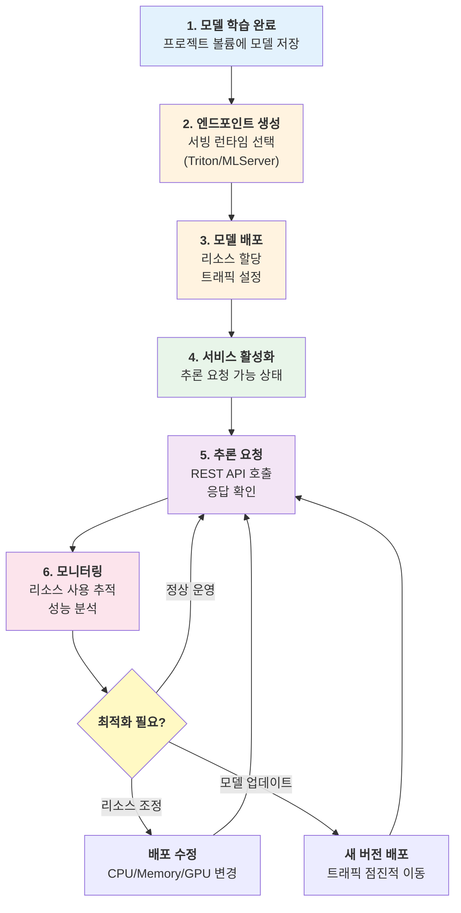

# 운영하기

개발한 머신러닝 모델을 프로덕션 환경에 배포하고, 안정적으로 서비스하며, 효율적으로 리소스를 관리하는 방법을 안내합니다.

Runway는 학습된 모델을 실제 서비스로 전환하는 전체 운영 프로세스를 지원합니다. REST API 기반의 모델 서빙 인프라와 실시간 리소스 모니터링을 통해 안정적이고 확장 가능한 AI/ML 서비스를 운영할 수 있습니다.

---

## 운영의 핵심 영역

Runway의 운영 기능은 두 가지 핵심 영역으로 구성됩니다.

### 모델 서빙

학습된 모델을 프로덕션 환경에 배포하고 외부 시스템에서 추론 요청을 받을 수 있도록 서비스화합니다. REST API 엔드포인트를 생성하고, 모델을 배포하며, 트래픽을 관리하여 안정적인 추론 서비스를 제공합니다.

**주요 기능:**

- **엔드포인트 관리**: REST API 접근 지점 생성 및 서빙 런타임 선택
- **모델 배포**: 프로젝트 볼륨의 모델을 엔드포인트에 배포
- **트래픽 컨트롤**: 여러 모델 버전 간 트래픽 분산 및 A/B 테스트
- **추론 요청**: curl, Python, API 클라이언트를 통한 모델 호출

### 리소스 모니터링

워크스페이스와 프로젝트의 CPU, 메모리, 디스크, GPU 등 컴퓨팅 리소스 사용 현황을 실시간으로 모니터링합니다. 리소스 할당 현황과 시간대별 사용 추이를 시각화하여 효율적인 리소스 관리와 용량 계획을 지원합니다.

**주요 기능:**

- **실시간 현황 확인**: CPU, Memory, Disk, GPU 사용률 조회
- **시간대별 추이 분석**: 1시간~7일 단위 리소스 사용 패턴 파악
- **할당률 모니터링**: 리소스 부족 또는 과다 할당 상황 감지
- **계층적 관리**: 워크스페이스 → 프로젝트 → 워크로드 단위 리소스 추적

---

## 주요 내용

-    **모델 서빙**

    ---

    학습된 모델을 REST API로 배포하여 외부 시스템에서 추론 요청을 받을 수 있도록 서비스화합니다. Triton, MLServer 런타임을 지원하며, 트래픽 분산과 A/B 테스트가 가능합니다.

     [모델 서빙하기](model-serving/)

-    **리소스 모니터링**

    ---

    워크스페이스와 프로젝트의 CPU, 메모리, 디스크, GPU 등 리소스 사용 현황을 실시간으로 모니터링합니다. 할당 현황과 시간대별 추이를 분석하여 리소스를 최적화할 수 있습니다.

     [리소스 모니터링하기](monitoring/)

## 운영 워크플로우

프로덕션 환경에서 모델을 안정적으로 운영하는 일반적인 흐름입니다.

