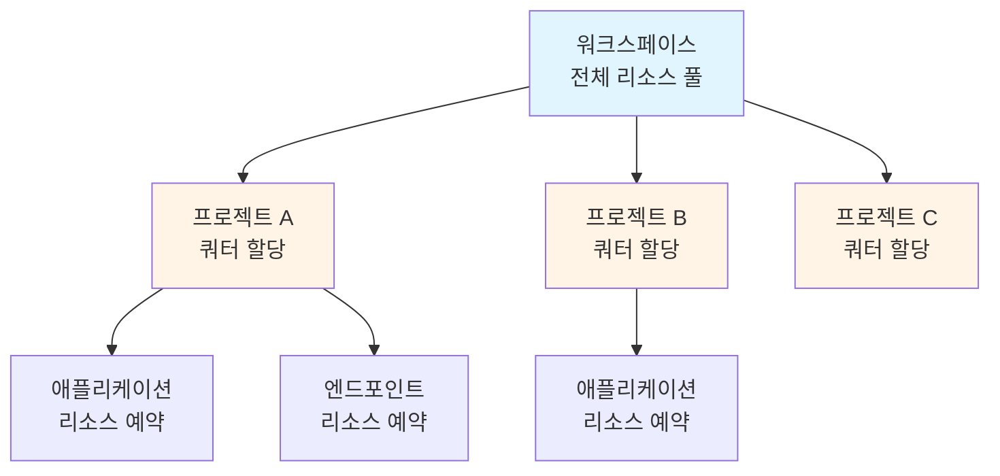

# 리소스 모니터링 이해하기

Runway는 워크스페이스와 프로젝트 단위로 리소스 사용 현황을 실시간으로 모니터링할 수 있는 기능을 제공합니다. CPU, 메모리, 디스크, GPU 등 주요 리소스의 할당 현황과 사용 추이를 시각화하여 효율적인 리소스 관리와 최적화를 지원합니다.

> 워크스페이스 > **모니터링** 메뉴
> 프로젝트 > **모니터링** 메뉴

---

## 주요 내용

-    **워크스페이스 리소스 모니터링**

    ---

    워크스페이스 전체 리소스 현황과 프로젝트별 리소스 사용 현황을 확인합니다.

     [워크스페이스 모니터링](workspace-monitoring.md)

-    **프로젝트 리소스 모니터링**

    ---

    프로젝트에 할당된 리소스와 실제 사용량을 시간대별로 분석합니다.

     [프로젝트 모니터링](project-monitoring.md)

---

## 모니터링이 필요한 이유

효과적인 리소스 모니터링은 안정적인 AI/ML 프로젝트 운영의 핵심입니다.

### 안정적인 서비스 운영

리소스 부족으로 인한 서비스 중단을 사전에 방지하고, 워크로드 실행 실패를 최소화할 수 있습니다. 실시간 모니터링을 통해 리소스 고갈 상황을 조기에 감지하고 대응할 수 있습니다.

### 비용 최적화

사용하지 않거나 과도하게 할당된 리소스를 식별하여 불필요한 비용을 절감할 수 있습니다. 리소스 사용률 분석을 통해 적정 규모의 인프라를 유지하고, 클라우드 비용을 효율적으로 관리할 수 있습니다.

### 성능 최적화

애플리케이션과 모델 서빙의 성능 병목 지점을 파악하여 최적화 전략을 수립할 수 있습니다. 시간대별 사용 패턴 분석을 통해 피크 타임 대비 리소스 확장 계획을 수립할 수 있습니다.

### 용량 계획

과거 사용 추이를 기반으로 미래의 리소스 수요를 예측하고, 사전에 용량을 확장할 수 있습니다. 프로젝트 성장에 따른 인프라 확장 시점을 적절히 판단할 수 있습니다.

---

## 리소스 관리 전략

Runway의 리소스 모니터링은 계층적 관리 구조를 통해 효율적인 리소스 할당과 사용을 지원합니다.

### 계층적 리소스 관리

**워크스페이스 레벨**

- 전체 리소스 용량(Capacity) 관리
- 프로젝트별 쿼터(Quota) 할당
- 전체 조직의 리소스 사용 현황 파악

**프로젝트 레벨**

- 할당받은 쿼터 내에서 워크로드 실행
- 애플리케이션, 엔드포인트 등에 리소스 예약
- 프로젝트 내 리소스 효율성 관리

### 핵심 리소스 지표

모니터링에서 추적하는 주요 지표들입니다.

| 지표 | 설명 | 활용 |
|------|------|------|
| **Capacity** | 전체 사용 가능한 리소스 총량 | 워크스페이스 또는 프로젝트에 할당된 최대 리소스 |
| **Assigned** | 프로젝트에 쿼터로 할당된 리소스 | 워크스페이스 리소스가 프로젝트에 어떻게 분배되었는지 확인 |
| **Allocated** | 워크로드에 예약된 리소스 | 실제 애플리케이션/엔드포인트가 사용을 예약한 리소스 |
| **Used** | 현재 실시간으로 사용 중인 리소스 | 실제 소비되고 있는 리소스량 |
| **Allocatable** | 추가 할당 가능한 여유 리소스 | 새로운 워크로드를 배포할 수 있는 여유 공간 |

> **Info**: 리소스 지표 관계
> 일반적으로 다음 관계가 성립합니다:
>
> - 워크스페이스: `Capacity ≥ Assigned ≥ Allocated ≥ Used`
> - 프로젝트: `Capacity ≥ Allocated ≥ Used`
>
> 이 관계를 통해 리소스의 과다 할당이나 비효율적 사용을 식별할 수 있습니다.

### 효율적인 리소스 활용 팁

** 정기적인 모니터링 습관화**

- 주간/월간 단위로 리소스 사용 추이를 점검합니다.
- 사용률이 낮은 프로젝트나 애플리케이션을 식별하여 리소스를 재분배합니다.

** 할당률 임계값 관리**

- 할당률 70% 이상: 추가 리소스 확보 검토
- 할당률 90% 이상: 즉시 리소스 확장 또는 워크로드 조정 필요
- 할당률 30% 미만: 과다 할당 가능성, 리소스 축소 검토

** 사용 패턴 분석**

- 시간대별 사용 추이를 분석하여 피크 타임을 파악합니다.
- 주기적인 패턴이 있다면 스케줄링을 통해 리소스를 효율적으로 활용합니다.

** 프로젝트별 최적화**

- 각 프로젝트의 실제 사용량과 할당량을 비교합니다.
- 과다 할당된 프로젝트의 쿼터를 조정하여 다른 프로젝트에 재분배합니다.

---

## 모니터링 대시보드 활용

### 워크스페이스 관점

워크스페이스 관리자는 전체 조직의 리소스 현황을 파악하고, 프로젝트 간 리소스 분배를 최적화할 수 있습니다.

- 전체 리소스 할당률 확인
- 프로젝트별 리소스 사용 비교
- 리소스 부족 또는 과다 할당 프로젝트 식별
- 워크스페이스 확장 시점 결정

### 프로젝트 관점

프로젝트 멤버는 할당받은 리소스 내에서 효율적으로 워크로드를 운영할 수 있습니다.

- 프로젝트 쿼터 대비 사용률 확인
- 애플리케이션/엔드포인트별 리소스 소비 분석
- 신규 워크로드 배포 가능 여부 판단
- 리소스 부족 시 워크스페이스 관리자에게 증설 요청

---